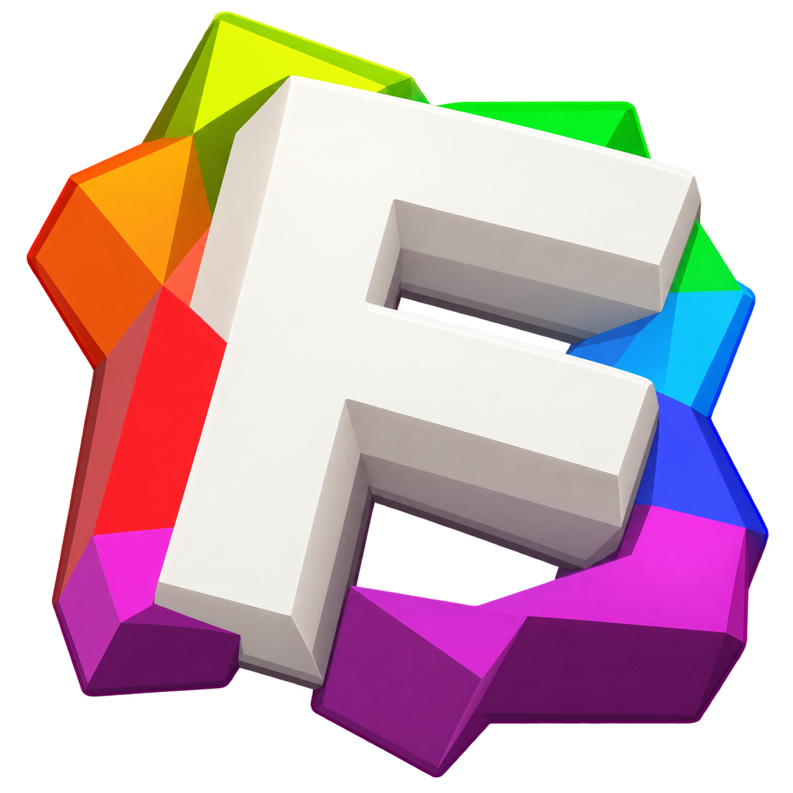
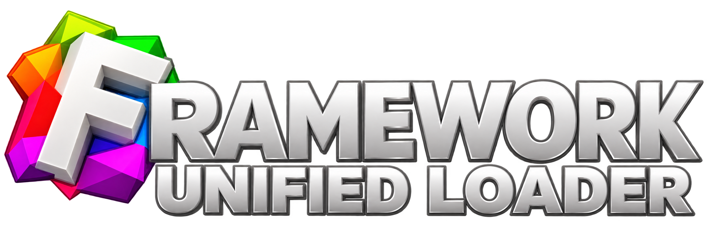
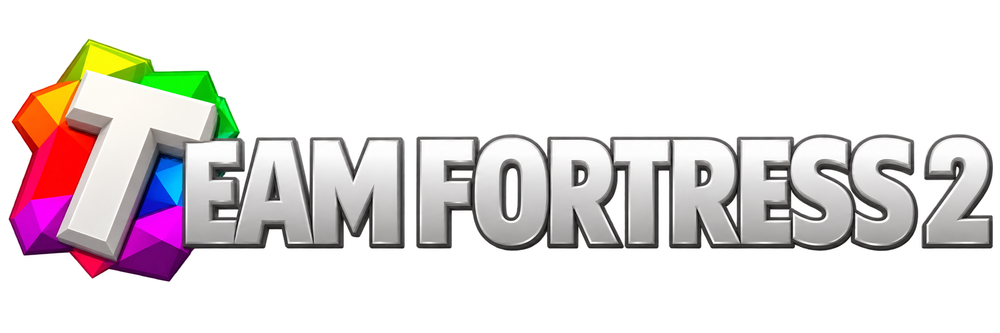
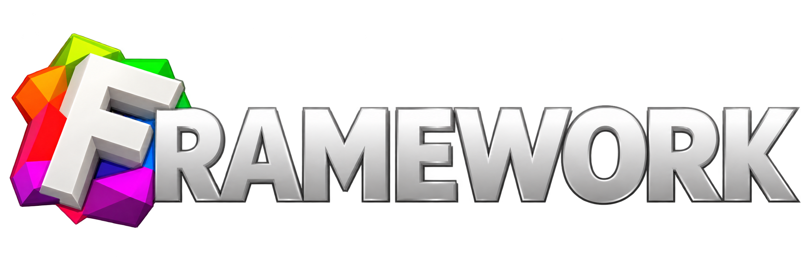

<div align="center">



# Framework Unified Loader

A modern, animated TF2 loader that ties together a VAC-safe module, the
[GuidedHacking Injector](https://github.com/guidedhacking/GuidedHacking-Injector),
an embedded manual mapper, and a self-checking launch loop behind a custom
D3D11 interface.

</div>

---

## What this is

A single executable that:
- Launches **several interchangeable software packages**
- Keeps Steam/VAC on the right side of the law via the integrateds
  **VACSAFE** module (Daniel Krupinski's VAC-Bypass, ported to x64),
- Injects the payload with GH Injector or a fallback manual mapper,
- **Verifies the game is genuinely healthy after injection** — and if it
  crashes or hangs, kills it and retries against a fresh `tf_win64.exe`
  (up to 3 attempts),
- Safely self-updates in the background,
- Ships as a Themida-packed binary with custom VM-protected critical regions.

---

## Screens

|||
|---|---|
| Animated splash + login | Product selection + launch screen |

The interface is a hand-rolled D3D11 / ImGui-free widget set: liquid animated
backgrounds, ease-driven transitions, an Inter font, hover/press/selection
states, a loading progress line and a status stage tracker.



---

## Feature highlights

- **Products** — Framework (the bundled `Synapse.dll`) is always selectable, and
  any additional DLL dropped next to the loader executable is appended to the
  product screen (listed by its file name). Loaded by index: 0 = bundled,
  1..N = the sidecar DLLs.
- **VACSAFE module** — the x64 port of VAC-Bypass is embedded as a resource
  and injected into Steam. Liveness is proven via a named mutex
  (`Local\FUL_VacBypass`), so a dead module is never silently accepted.
  Three modes: auto (restart Steam if needed), `-secure` (force), `-nobypass`
  (skip, when you bring your own bypass).
- **Injection via GH Injector** — the full GuidedHacking Injector runtime
  (exe + Qt5 DLLs + plugins) is embedded and extracted on demand, then invoked
  with packer-friendly flags: manual mapping, thread cloaking, PEB/header
  handling and a DllMain wait.
- **Fallback injector** — a built-in manual mapper (`MM::Inject`) and a
  debug LoadLibrary path (`-ll`).
- **Verified launch loop** — waits for `tf_win64.exe`, then waits for
  `ServerBrowser.dll` (the last module mapped before the main menu is ready),
  injects, and monitors the process for `kVerifySeconds`. A crash, an
  unresponsive window, or a frozen working set triggers a kill + fresh
  relaunch, up to `kMaxInjectAttempts`.
- **Self-updater** — a background thread compares the remote build timestamp
  against the running executable and stages a replacement applied on exit.
- **Music** — a bundled looped track plays through MCI from the login screen;
  `-silent` mutes it.
- **Auth** — ships with a provided placeholder auth header baked in:
  login **Framework**, password **Password** (stored as a salted SHA-256 in
  `creds.h`, the plaintext never reaches the binary). For per-user builds,
  regenerate it with `make-creds.ps1` (username + salted SHA-256 of an access
  key, expiry date and build ID). Supports offline builds after a prior login.
- **Discord Rich Presence** — shows a status card while running.
- **Always on top** — the loader window stays visible over the game overlay.
- **Out-of-the-box Themida support** — sensitive routines are wrapped in
  custom VM markers (`FISH`, `EAGLE`, `LION`, `SHARK`, `DOLPHIN`, `PUMA`,
  `FALCON_TINY` / `MUTATE`). The Secure build packs cleanly with Themida and
  keeps every `Start`/`End` region balanced for post-build verification. The
  standard Release build compiles the markers out and has no Themida
  dependency.

---

## Products

| Key | Product   | Build        | About                                            |
|-----|-----------|--------------|--------------------------------------------------|
| 0   | Framework | Framework    | The bundled fallback (always listed)             |

**Framework** (the embedded `Synapse.dll`) is always listed first. Any
additional `*.dll` placed next to the loader is appended to the product screen
as a selectable software (its file name is the title, e.g. `Amalgam.dll`
appears as **Amalgam**, description "An externally detected DLL"). The product
index maps 0 -> the bundled payload, 1..N -> the listed DLLs, and the same
enumeration is used when loading. Selection happens on the loader's product
screen; launch starts only when you press **Secure Launch**.

---

## Requirements

- Windows 8 or newer, x64
- Visual Studio 2022 with the "Desktop development with C++" workload (for builds)
- [Themida 3.x](https://www.oreans.com/themida.php) for the final packed build *(optional)*
- The product DLLs you want to serve, placed next to the loader executable
- Administrator rights (the loader requests elevation on start)

---

## Compiling

### 1. Build the loader

Two x64 build configurations are provided:

| Configuration | Preprocessor  | Requires Themida | Output                                |
|---------------|---------------|------------------|---------------------------------------|
| `Release`     | —             | No               | `bin\Release\Framework Unified Loader.exe` |
| `Secure`      | `FUL_SECURE`  | Yes              | `bin\Secure\Framework Unified Loader.exe`  |

```
# Standard build - no Themida dependency, no SecureEngineSDK64.dll required
msbuild FUL.sln /p:Configuration=Release /p:Platform=x64 /m /v:m

# Secure build - keeps the Themida VM markers; needs FUL\vendor\ThemidaSDK locally
msbuild FUL.sln /p:Configuration=Secure /p:Platform=x64 /m /v:m
```

The VM markers are gated by `src\Utils\FULVM.h`: standard builds compile them
out completely (clean, dependency-free runs), while the `Secure` build emits
the import calls Themida consumes when packing. The Oreans SDK folder is not
distributed with the repo — copy it in locally for `Secure` builds.

### 2. (Optional) Bake credentials

```powershell
.\make-creds.ps1 -Username <user> -AccessKey "<key>" -Expires "2026-12-31" -BuildId "<build>"
```

This writes `FUL\src\Loader\Auth\creds.h` with the *salted SHA-256 hash*
of the access key — the plaintext key never reaches the binary. Re-run for each
user build, then rebuild.

### 3. (Optional) Pack with Themida

1. Patch `bin\Secure\Framework Unified Loader.exe` with Themida64.
2. Pick the protection profile and any machine-binding / VM options you need.
3. Save as `Synapse.exe` (or your chosen loader name).

The build ships with all custom VM regions correctly balanced, so it packs
and parses cleanly out of the box.

### 4. Add your payloads

Drop any DLLs next to the loader:

```
MyCheat.dll
Synapse.dll
```

Every DLL present is appended to the product screen as a selectable software
(the filename, minus extension, is the title). Known support libraries
(`SecureEngineSDK64.dll` / `SecureEngineSDK32.dll`) are filtered out.
**Framework** (the bundled `Synapse.dll`, index 0) is always available.

---

## Usage

Run the loader **as administrator**.

- Log in with your username + access key (or start with `-offline` if you've
  logged in before).
- Pick a product on the selection screen.
- Press **Secure Launch**.

The loader will:

1. Ensure the VACSAFE module is live in Steam (restarting Steam if needed),
2. Wait for TF2 to appear,
3. Wait for the client to finish loading (`ServerBrowser.dll`),
4. Inject the selected DLL,
5. Verify the game is alive, responsive and making progress,
6. On failure — kill and relaunch, up to 3 times.

---

## Command-line arguments

| Argument     | Effect                                                            |
|--------------|-------------------------------------------------------------------|
| `-silent`    | Mute the loader music                                             |
| `-offline`   | Skip login (only after a prior successful login)                  |
| `-secure`    | Force the VACSAFE bypass even if already active                   |
| `-nobypass`  | Never run the VAC bypass (you bring your own)                     |
| `-ll`        | Debug load: LoadLibrary instead of manual map / GH                |
| `-debug`     | Show a console and enable debug logging                          |
| `-no-gh`     | Skip GH Injector, use the embedded manual mapper                  |
| `-cache` / `-no-cache` | Force or deny cached (offline) startup, persisted in the registry |
| `-file <path>` | Use a specific DLL file instead of the bundled payload          |
| `-url <url>` | Download the payload from a URL                                   |
| `-gh <path>` | Use an external GH Injector executable                            |
| `-inject`    | Auto-launch injection on startup                                  |
| `-shot [path]`, `-t <sec>` | Headless screenshot capture for UI development     |

---

## Project layout

```
FUL/
  src/
    WinMain.cpp          entry point, window + D3D11 + main loop
    LaunchInfo.h         CLI/config object shared by the app and loader
    Loader/              launch pipeline (bypass, injectors, updater)
      Bypass/             VACSAFE module handling
      Injector/
        ManualMap/        fallback built-in mapper
        LoadLibrary/      debug loader
      Auth/               baked credentials + login
      Music/              MCI-backed music player
    Gui/
      app/                screens (splash, login, product, status), assets
      gfx/                D3D11 renderer, image loading (WIC)
      ui/                 widgets, fonts, animation helpers
    Utils/                processes, resources, settings, crypto, logging
  res/                    images, icon, embedded runtimes and payload
  FUL.rc / resource.h  embedded resources (GH runtime, VACSAFE, payload, music, icon)
make-creds.ps1            per-user credential baking
FUL.sln              solution to open in Visual Studio
```

---

## Acknowledgements

This loader builds on work that others shared openly. It could not exist
without them:

1. **[Brihon](https://github.com/guidedhacking)** and the Guided Hacking team,
   for the [GuidedHacking Injector](https://github.com/guidedhacking/GuidedHacking-Injector).
2. **[Dopamina.dev](https://hackvshack.net/)** and **bogdanuq**, for the
   original GUI this loader project started with —
   [Astral Loader / Wannabe Framework](https://hackvshack.net/threads/astral-loader-wannabe-framework.13357/).
3. **[Daniel Krupinski](https://github.com/danielkrupinski)**, for
   [VAC-Bypass](https://github.com/danielkrupinski/VAC-Bypass/), ported to
   64-bit for the integrated VACSAFE module.
4. A thank you to the people who got me to finally stop burying what I truly
   am under all the covers and restrictions I had imposed on myself.
5. An extra thank you to those who taught me everything I know now.
6. Roy Jones Jr. for making the [Music](https://www.youtube.com/watch?v=GoCOg8ZzUfg)